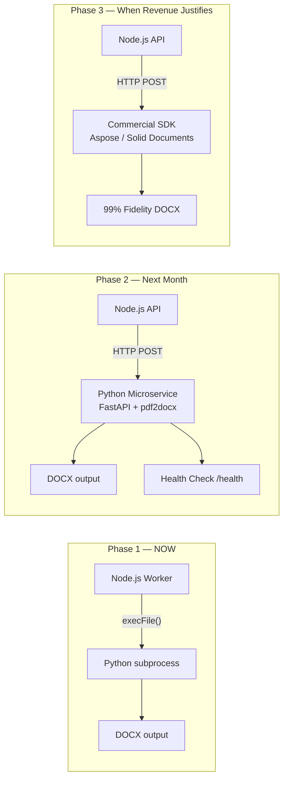

# PDF→Word Conversion Engine — Future Roadmap & Cost Analysis

*Created: 2026-08-29 | Author: CTO/Co-founder*

---

## Architecture Evolution

---

## Phase 2: Python Converter Microservice

**When:** After 100+ daily active users or before horizontal scaling.

**What changes:**
- Extract `pdf_to_docx_engine.py` into a standalone FastAPI service
- Node.js sends `POST /convert` with the PDF buffer, receives DOCX buffer back
- Docker Compose: `web` (Node.js) + `converter` (Python FastAPI)
- Converter service auto-scales independently (can run multiple replicas)

**Benefits over Phase 1:**
- No subprocess spawn overhead (~200ms saved per conversion)
- Can scale converter independently (3 Node.js instances + 1 beefy converter)
- Health checks, metrics, and logging isolation
- Can deploy converter on a GPU/high-memory instance if needed

### Phase 2 Infrastructure Costs

#### Option A: AWS (ECS / Fargate)

| Component | Spec | Monthly Cost |
|:---|:---|:---|
| Node.js API (Fargate) | 0.5 vCPU, 1GB RAM | ~$15 |
| Python Converter (Fargate) | 1 vCPU, 2GB RAM | ~$30 |
| Application Load Balancer | Standard | ~$18 |
| S3 (file storage) | 50GB + transfers | ~$3 |
| ECR (Docker images) | 2 images | ~$1 |
| **Total** | | **~$67/month** |

#### Option B: Railway / Render (Simplest)

| Component | Spec | Monthly Cost |
|:---|:---|:---|
| Node.js service | 0.5 vCPU, 512MB RAM | ~$5 |
| Python converter service | 1 vCPU, 2GB RAM | ~$10–$20 |
| Persistent storage | 1GB | ~$1 |
| **Total** | | **~$16–$26/month** |

#### Option C: Single VPS (Hetzner / DigitalOcean)

| Component | Spec | Monthly Cost |
|:---|:---|:---|
| VPS (Docker Compose) | 2 vCPU, 4GB RAM, 80GB SSD | ~$6–$12 |
| Domain + SSL | Let's Encrypt | Free |
| **Total** | | **~$6–$12/month** |

> [!TIP]
> **Recommended for early stage:** Option C (single VPS with Docker Compose) at ~$6–12/month. Move to Option A (AWS) only when you need auto-scaling or multi-region deployment.

---

## Phase 3: Commercial SDK Integration

**When:** After consistent revenue ($500+/month) or when 85% accuracy isn't enough for enterprise clients.

### Commercial SDK Comparison

| SDK | Language | PDF→DOCX Quality | Annual License | Per-API-Call |
|:---|:---|:---|:---|:---|
| **Aspose.Words** | .NET / Java / Python | 92–95% | $3,599/yr (OEM) | N/A |
| **Solid Documents** | C++ SDK | 97–99% (iLovePDF uses this) | $10K–$50K/yr | N/A |
| **Adobe PDF Services API** | REST API | 95–98% | N/A | $0.05/transaction |
| **CloudConvert API** | REST API | 80–85% (LibreOffice) | N/A | $0.02/transaction |
| **ConvertAPI** | REST API | 88–92% | $15/month (1500 conversions) | ~$0.01 each |

### Cost Projection by User Volume

| Monthly Conversions | Aspose (Self-hosted) | Adobe PDF Services | ConvertAPI |
|:---|:---|:---|:---|
| 500 | $300/month (license) | $25/month | $15/month |
| 5,000 | $300/month | $250/month | $50/month |
| 50,000 | $300/month | $2,500/month | $500/month |
| 500,000 | $300/month | $25,000/month | $5,000/month |

> [!IMPORTANT]
> **Aspose wins at scale** because it's a flat annual license regardless of volume. Adobe and ConvertAPI charge per-conversion, which gets expensive fast. Solid Documents is the gold standard (what iLovePDF actually uses) but requires a sales call and enterprise agreement.

### Recommended Phase 3 Path

1. **Start with ConvertAPI** ($15/month) as a quick integration test to validate quality
2. **Switch to Aspose.Words** ($3,599/year ≈ $300/month) once you have 1,000+ monthly conversions
3. **Negotiate Solid Documents** license only if enterprise clients demand 99%+ fidelity

---

## Decision Matrix: When to Move to Each Phase

| Signal | Action |
|:---|:---|
| 0–100 daily users | Stay on Phase 1 (Python subprocess) |
| 100–500 daily users | Move to Phase 2 (microservice) |
| Users complain about quality on complex PDFs | Evaluate Phase 3 commercial SDKs |
| Enterprise clients / revenue > $500/month | Integrate Aspose.Words |
| Revenue > $5K/month + enterprise contracts | Negotiate Solid Documents |

---

## Summary

| Phase | Accuracy | Monthly Cost | Time to Ship |
|:---|:---|:---|:---|
| **Phase 1** (Now) | ~85% | $0 (local Python) | 1–2 days |
| **Phase 2** (Microservice) | ~85% | $6–67/month | 1 week |
| **Phase 3a** (ConvertAPI) | ~90% | $15/month | 1 day |
| **Phase 3b** (Aspose) | ~95% | $300/month | 3–5 days |
| **Phase 3c** (Solid Docs) | ~99% | $800+/month | Enterprise negotiation |
