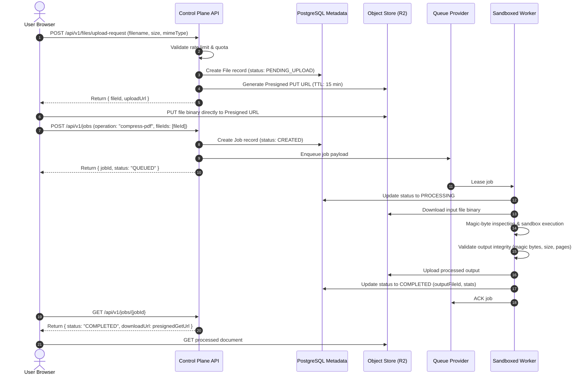

# SYSTEM OVERVIEW & ARCHITECTURE SPECIFICATION
**Document Utility & Infrastructure Platform**

---

## 1. HIGH-LEVEL ARCHITECTURE TOPOLOGY

```text
                                 [ USER / CLIENT ]
                                        │
                 ┌──────────────────────┴──────────────────────┐
                 ▼                                             ▼
       [ Local WASM Worker ]                          [ Experience Layer ]
    (Merge, Rotate, Reorder)                       (Next.js App Router / SSR)
                 │                                             │
                 │ (If server processing needed)               ▼
                 └───────────────────────────────►    [ Control Plane API ]
                                                   (Fastify / Route Handlers)
                                                               │
                           ┌───────────────────────────────────┼───────────────────────────────────┐
                           ▼                                   ▼                                   ▼
                 [ Storage Provider ]                  [ Database Repo ]                   [ Queue Provider ]
               (Cloudflare R2 / S3)                 (PostgreSQL Metadata)               (Redis / Cloud Tasks)
                 ▲                 ▲                                                               │
                 │ (Direct Upload) │ (Direct Download)                                             │
                 │                 │                                                               ▼
                 └─────────┬───────┴────────────────────────────────────────────────────► [ Worker Sandbox Pool ]
                           │                                                               (PDF, OCR, AI Engines)
                           │                                                                       │
                           └──────────────────────── Output Artifact ─────────────────────────────┘
```

---

## 2. LAYER BREAKDOWN & RESPONSIBILITIES

### Layer 1: Experience Layer (`apps/web`)
- **Technology**: Next.js 15+, TypeScript, React 19, Vanilla/Tailwind CSS, Web Workers / WASM.
- **Responsibilities**:
  - Programmatic SEO landing pages for each tool (`/merge-pdf`, `/compress-pdf`, etc.) with rich JSON-LD schema.
  - WCAG 2.1 AA accessible UI (keyboard navigation, accessible progress indicators, focus rings, screen reader announcements).
  - Drag-and-drop file pipeline with instant client-side magic byte validation.
  - Client-side execution engine for lightweight jobs (zero cloud cost, instant completion).
  - Upload coordinator for direct-to-storage presigned URLs.

### Layer 2: Control Plane API (`apps/control-plane` or modular API routes)
- **Technology**: Fastify / Node.js / Next Route Handlers, Zod schemas, Type-safe controllers.
- **Responsibilities**:
  - Authenticate requests (Supabase Auth / JWT) and manage user/org sessions.
  - Generate short-lived presigned upload/download URLs via `StorageProvider`.
  - Rate limiting, anti-abuse checks, and tier entitlement quotas (Anonymous vs Pro vs Business).
  - Job creation, validation, status polling / SSE streaming, and cancellation.

### Layer 3: Job & Workflow Queue (`packages/providers/queue`)
- **Technology**: Pluggable `QueueProvider` (In-Memory for tests, Redis/BullMQ or Cloud Tasks for production).
- **Responsibilities**:
  - Job lifecycle state machine: `CREATED` $\to$ `QUEUED` $\to$ `PROCESSING` $\to$ `VALIDATING` $\to$ `COMPLETED` / `FAILED`.
  - Concurrency management and backpressure controls.
  - Safe retries with exponential backoff for transient failures.

### Layer 4: Processing Layer (`packages/workers`)
- **Technology**: Node.js / Rust / Go / Python micro-workers behind strict sandbox wrappers.
- **Engines**:
  - Core PDF: `pdf-lib`, `qpdf`, `mupdf`
  - Document Conversions: LibreOffice headless / Poppler
  - OCR: Tesseract / Cloud Vision
  - Document Intelligence: AI Provider abstraction (OpenAI, Anthropic, Gemini, Local models)
- **Safety Protections**:
  - Memory caps (e.g. 512MB default).
  - Execution timeouts (default 60s per job).
  - Temp disk cleanup in `finally` blocks.
  - Post-processing output validation (verifying PDF magic bytes, page count, and non-zero byte size).

### Layer 5: Storage Layer (`packages/providers/storage`)
- **Technology**: Cloudflare R2 (zero egress fees) / AWS S3 / Google Cloud Storage.
- **Responsibilities**:
  - Storage of input originals, intermediate steps, and processed outputs.
  - Automated lifecycle TTL policies (1-2 hour deletion for anonymous outputs, configurable for registered users).
  - PostgreSQL database stores only structured metadata (Job IDs, timestamps, file sizes, hashes, owner IDs). **No raw binaries in PostgreSQL.**

---

## 3. END-TO-END DATA FLOW (SERVER-SIDE JOB)


